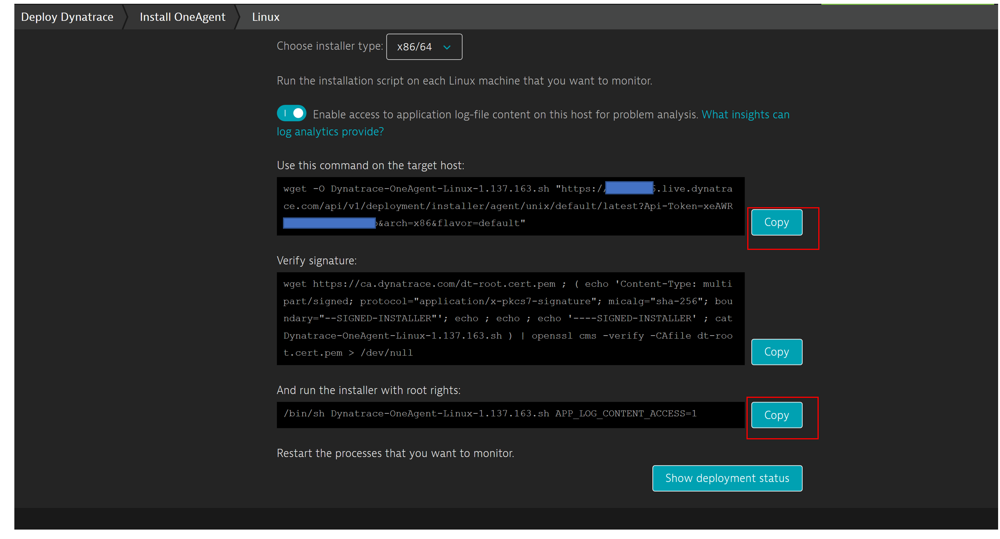
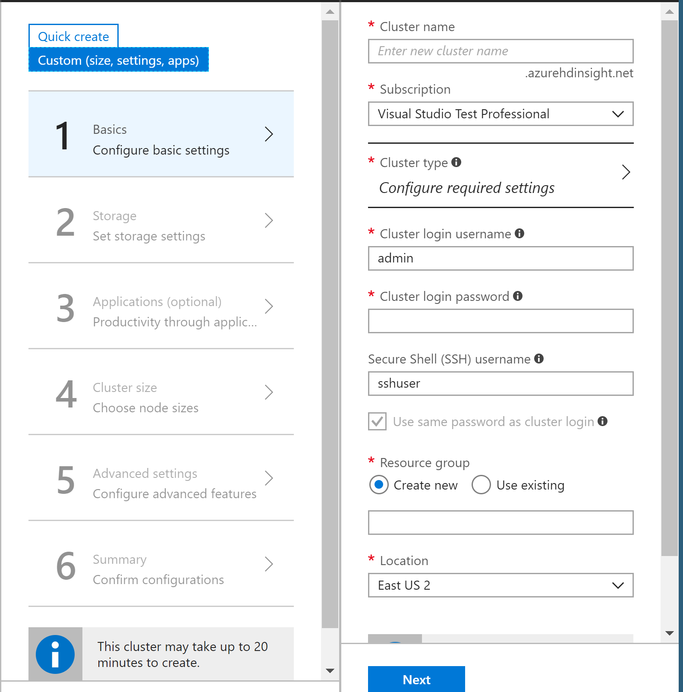
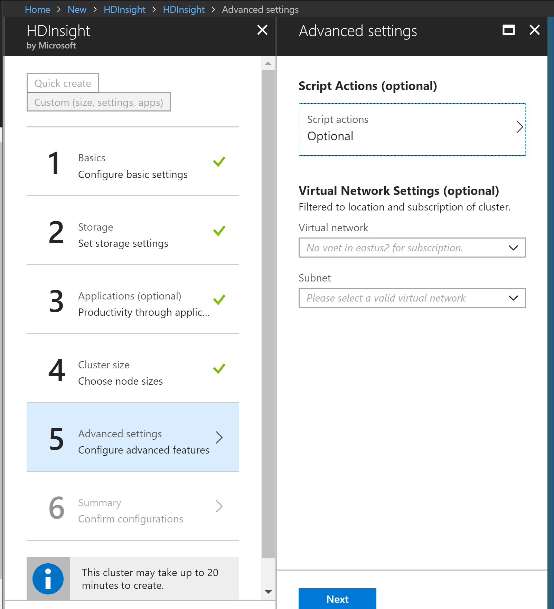
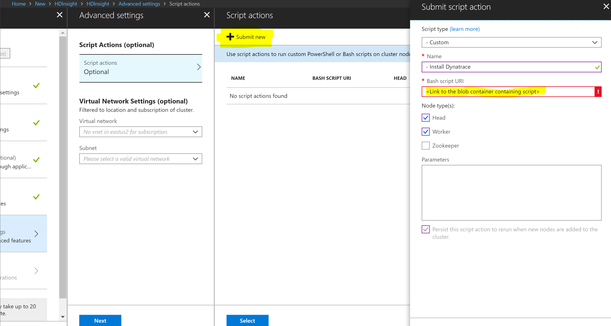

# Installing the Dynatrace One Agent on the HDInsight cluster

A full video demonstrating the installation is available here: https://youtu.be/pnT0HBSTFcw

Login to the Dynatrace Console 
Go to Deploy Dynatrace
Select Linux installation and copy the wget URL and install script in a notepad (name the file installAction.sh)


**The installAction.sh looks as follows**
```js
wget  -O Dynatrace-OneAgent-Linux-1.137.163.sh "https://YOURTENANT.live.dynatrace.com/api/v1/deployment/installer/agent/unix/default/latest?Api-Token=YOURAPITOKEN&arch=x86&flavor=default"
 /bin/sh Dynatrace-OneAgent-Linux-1.137.163.sh  APP_LOG_CONTENT_ACCESS=1 
 ```
 Copy this file in a Blob Storage Container and Note the URL -> Make this file publically accessible. By default it is private

**Creating HDInsights cluster through Azure Portal**

Login to the Azure portal
Start creating a HDInsights cluster
In the creation wizard select the Custom cluster option 


Provide the name of the cluster and other details 

Under Step 5 Advanced Settings Select Script Options


Select Submit New Script Action

Script Type -> Custom 

Provide the link to the Blob storage container (Containing the installAction.sh) in the URI section

Select Head and Worker process for installing agent 



Complete the installation by creating the cluster. All the nodes will have the Dynatrace OneAgent installed 

Go to Dynatrace Web UI and the cluster nodes and verify the installation
