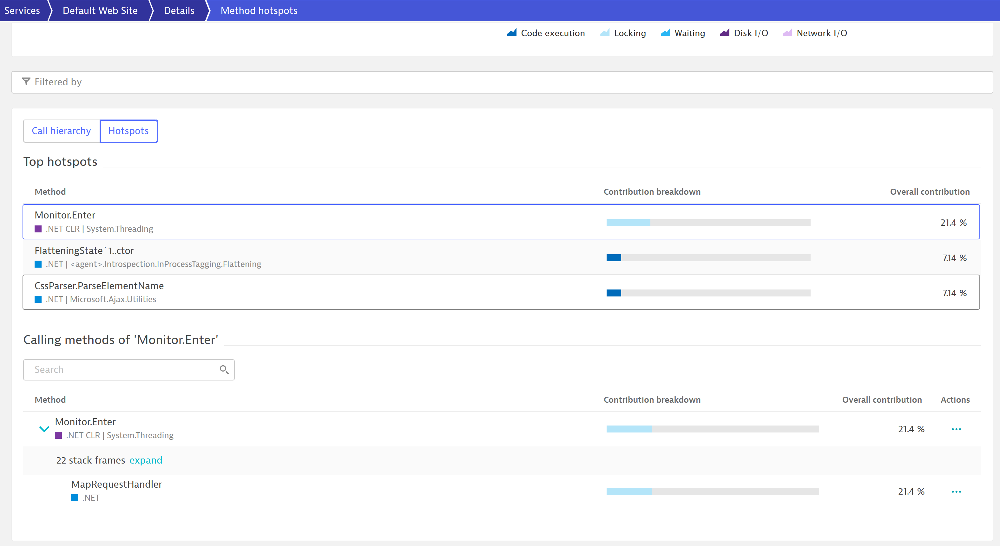

# Monitoring Windows Server Containers with Dynatrace
Sample.yaml file is a working sample of instrumenting Windows Containers with Dynatrace. 

## To Deploy sample.yaml
Replace the values of <YourDTTenant> and <PaasToken> to start getting data from the sample ASP.NET application into your Dynatrace environment (Works on both SaaS and Managed) 

## What do you get

  ### Full process monitoring 
  
  ### Full Code level visibility 
  
  
  
## To use with your applications 
Add the enviornment variable for .NET Framework , .NET CORE, initcontainers install-oneagent sections into your application yaml to instrument your applications with Dynatrace agent  

